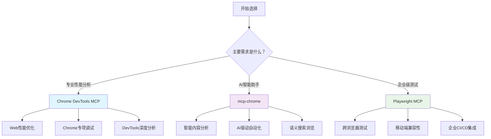

# 浏览器自动化MCP工具全面对比分析

> **文档版本**: v1.0
> **最后更新**: 2025年1月28日
> **作者**: Claude Code

本文档对三个主流的浏览器自动化MCP(Model Context Protocol)工具进行全方位对比分析，为开发者和企业选择合适的解决方案提供详尽的技术参考。

## 📖 目录

- [概述与对比总览](#概述与对比总览)
- [技术架构深度分析](#技术架构深度分析)
- [登录状态保持机制对比](#登录状态保持机制对比)
- [调试与开发体验对比](#调试与开发体验对比)
- [性能与资源消耗分析](#性能与资源消耗分析)
- [功能特性详细对比](#功能特性详细对比)
- [配置与部署复杂度](#配置与部署复杂度)
- [生态系统与维护性](#生态系统与维护性)
- [使用场景与最佳实践](#使用场景与最佳实践)
- [总结与选择建议](#总结与选择建议)

---

## 概述与对比总览

### 项目基本信息

| 维度 | Chrome DevTools MCP | mcp-chrome | Playwright MCP |
|------|-------------------|------------|----------------|
| **开发方** | Google ChromeDevTools团队 | 社区开发者 (hangwin) | Microsoft官方 |
| **GitHub仓库** | ChromeDevTools/chrome-devtools-mcp | hangwin/mcp-chrome | microsoft/playwright-mcp |
| **Stars数量** | 5.1k+ | 8.2k+ | 20.6k+ |
| **最新版本** | v0.4.0 | v0.0.6 | v0.0.40 |
| **开发活跃度** | 高 (116 commits) | 高 (89 commits) | 极高 (388 commits) |
| **主要语言** | TypeScript (97.1%) | TypeScript (57.9%) | TypeScript (55.2%) |
| **开源协议** | Apache-2.0 | MIT | Apache-2.0 |
| **发布频率** | 频繁 (11个版本) | 稳定 (6个版本) | 极频繁 (32个版本) |

### 核心定位差异

1. **Chrome DevTools MCP**: 专业级Chrome调试和性能分析工具
2. **mcp-chrome**: 智能浏览器助手，AI驱动的日常浏览增强
3. **Playwright MCP**: 企业级跨浏览器自动化测试平台

---

## 技术架构深度分析

### Chrome DevTools MCP - 专业DevTools架构

```typescript
// 基于puppeteer-core + Chrome DevTools Protocol
import {Browser, Page} from 'puppeteer-core';

export class McpContext {
  browser: Browser;
  #networkCollector: NetworkCollector;
  #consoleCollector: PageCollector<ConsoleMessage>;
  #textSnapshot: TextSnapshot | null;
  #traceResults: TraceResult[];

  // 26个专业工具分类
  tools = [
    ...consoleTools,      // 调试工具 (4个)
    ...emulationTools,    // 模拟工具 (3个)
    ...performanceTools,  // 性能分析 (3个)
    ...networkTools,      // 网络分析 (2个)
    ...inputTools,        // 输入自动化 (7个)
    ...pagesTools,        // 导航自动化 (7个)
  ];
}
```

**技术特色**：
- ✅ **纯Chrome DevTools API集成** - 直接访问Chrome原生调试功能
- ✅ **专业性能分析** - trace录制、Core Web Vitals、网络时序分析
- ✅ **企业级稳定性** - Google官方维护，持续更新
- ✅ **accessibility快照系统** - 结构化页面元素访问

### mcp-chrome - Chrome扩展架构

```typescript
// 基于Chrome Extension + Native Messaging + WebAssembly
interface ChromeExtensionMCP {
  // Chrome扩展直接操作浏览器
  chromeAPI: chrome.tabs | chrome.bookmarks | chrome.history;

  // 语义搜索能力
  vectorDatabase: {
    simdOptimized: true,     // WebAssembly SIMD优化
    performance: "4-8x faster",
    searchType: "semantic"
  };

  // 跨标签上下文
  crossTabContext: {
    tabManagement: true,
    contentAnalysis: true,
    smartNavigation: true
  };

  // 连接方式
  connection: {
    streamableHTTP: "http://127.0.0.1:12306/mcp",
    stdio: "mcp-chrome-bridge/dist/mcp/mcp-server-stdio.js"
  };
}
```

**技术特色**：
- ✅ **Chrome扩展原生集成** - 直接操作用户现有浏览器实例
- ✅ **保持用户环境** - 登录状态、配置、扩展程序全部保留
- ✅ **语义搜索引擎** - 内置向量数据库，AI内容理解
- ✅ **SIMD加速优化** - WebAssembly实现4-8倍性能提升
- ✅ **流式HTTP连接** - 支持实时双向通信

### Playwright MCP - 跨浏览器企业架构

```typescript
// 基于Playwright跨浏览器框架
interface PlaywrightMCP {
  // 多浏览器支持
  browsers: {
    chrome: Browser,
    firefox: Browser,
    webkit: Browser,
    msedge: Browser
  };

  // 企业级配置
  config: {
    isolated: boolean,           // 隔离会话
    storageState: string,        // 存储状态
    userDataDir: string,         // 用户数据目录
    device: "iPhone 15",         // 设备模拟
    viewport: "1280x720",        // 视口尺寸
    permissions: string[],       // 权限授予
    proxy: ProxySettings        // 代理配置
  };

  // 可选能力模块
  capabilities: {
    vision: boolean,    // 视觉坐标点击
    pdf: boolean,       // PDF生成
    tracing: boolean,   // 执行追踪
    verify: boolean     // 页面验证
  };
}
```

**技术特色**：
- ✅ **真正跨浏览器支持** - Chrome/Firefox/Safari/Edge统一API
- ✅ **企业级配置管理** - 完整的配置文件、存储状态、权限控制
- ✅ **浏览器扩展集成** - 连接现有浏览器标签
- ✅ **设备和网络模拟** - 移动设备、网络条件完整模拟
- ✅ **模块化能力扩展** - 按需启用视觉、PDF、追踪等高级功能

---

## 登录状态保持机制对比

### Chrome DevTools MCP - 持久用户数据目录

**官方文档说明** (来源: [GitHub README.md](https://github.com/ChromeDevTools/chrome-devtools-mcp#user-data-directory)):

```bash
# 用户数据目录位置
# Linux / MacOS
$HOME/.cache/chrome-devtools-mcp/chrome-profile-$CHANNEL

# Windows
%HOMEPATH%/.cache/chrome-devtools-mcp/chrome-profile-$CHANNEL

# 配置示例
{
  "mcpServers": {
    "chrome-devtools": {
      "command": "npx",
      "args": [
        "chrome-devtools-mcp@latest",
        "--channel=stable",      # 指定Chrome通道
        "--isolated=false"       # 关闭隔离模式保持登录状态
      ]
    }
  }
}
```

**登录状态保持机制**：
- ✅ **持久化存储**: 用户数据目录在会话间保持不变
- ✅ **多实例共享**: 所有chrome-devtools-mcp实例共享同一用户数据目录
- ✅ **登录状态继承**: Cookie、Session、LocalStorage全部保留
- ⚠️ **手动登录一次**: 首次使用需要登录，后续自动保持

### mcp-chrome - 直接使用现有浏览器

**官方说明** (来源: [GitHub项目介绍](https://github.com/hangwin/mcp-chrome)):

```markdown
## 🆚 Comparison with Similar Projects

| Comparison Dimension | Playwright-based MCP Server | Chrome Extension-based MCP Server |
|---------------------|-----------------------------|------------------------------------|
| User Session Reuse | ❌ Requires re-login | ✅ Automatically uses existing login state |
| Browser Environment | ❌ Clean environment lacks user settings | ✅ Fully preserves user environment |
| Startup Speed | ❌ Requires launching browser process | ✅ Only needs to activate extension |
```

**登录状态保持机制**：
- ✅ **零配置登录**: 直接使用用户已登录的Chrome浏览器
- ✅ **实时状态同步**: 与用户日常浏览完全同步
- ✅ **环境完整保留**: 扩展程序、主题、书签、历史记录全部保留
- ✅ **即开即用**: 无需任何登录操作

### Playwright MCP - 三种登录状态模式

**官方文档说明** (来源: [GitHub配置文档](https://github.com/microsoft/playwright-mcp#user-profile)):

```bash
# 1. 持久化配置文件 (默认模式)
# Windows: %USERPROFILE%\AppData\Local\ms-playwright\mcp-{channel}-profile
# macOS: ~/Library/Caches/ms-playwright/mcp-{channel}-profile
# Linux: ~/.cache/ms-playwright/mcp-{channel}-profile

# 2. 隔离模式配置
{
  "mcpServers": {
    "playwright": {
      "command": "npx",
      "args": [
        "@playwright/mcp@latest",
        "--isolated",                                    # 隔离模式
        "--storage-state=/path/to/storage.json"        # 预设存储状态
      ]
    }
  }
}

# 3. 浏览器扩展模式
{
  "mcpServers": {
    "playwright": {
      "command": "npx",
      "args": [
        "@playwright/mcp@latest",
        "--extension"     # 连接现有浏览器实例
      ]
    }
  }
}
```

**登录状态保持机制**：
- ✅ **持久模式**: 类似Chrome DevTools MCP，保持登录状态
- ✅ **隔离模式**: 每次重新开始，支持预设存储状态导入
- ✅ **扩展模式**: 连接现有浏览器标签，保持所有状态
- ✅ **灵活配置**: 三种模式满足不同安全和便利需求

### 登录状态保持对比总结

| 维度 | Chrome DevTools MCP | mcp-chrome | Playwright MCP |
|------|-------------------|------------|----------------|
| **默认行为** | 持久化用户数据目录 | 直接使用现有浏览器 | 持久化配置文件 |
| **登录便利性** | 🟡 首次需登录 | 🟢 零配置即用 | 🟡 首次需登录 |
| **状态同步** | 🟡 独立会话 | 🟢 实时同步 | 🟡 独立会话 |
| **环境保持** | 🟡 基本环境 | 🟢 完整环境 | 🟢 完整环境(扩展模式) |
| **安全隔离** | 🟢 良好隔离 | 🟡 共享环境 | 🟢 多模式选择 |
| **企业适用** | 🟢 适合 | 🟡 需评估 | 🟢 非常适合 |

---

## 调试与开发体验对比

### Chrome DevTools MCP - 专业级调试体验

**调试工具集** (26个工具):
```typescript
// 性能分析工具 (3个)
- performance_start_trace: 开始性能跟踪
- performance_stop_trace: 停止跟踪并分析
- performance_analyze_insight: 深度性能洞察

// 网络调试工具 (2个)
- get_network_request: 获取特定网络请求详情
- list_network_requests: 列出所有网络请求(支持资源类型过滤)

// 控制台调试工具 (4个)
- list_console_messages: 获取控制台消息
- evaluate_script: 执行JavaScript代码
- take_screenshot: 页面截图
- take_snapshot: 页面accessibility快照

// 模拟测试工具 (3个)
- emulate_cpu: CPU节流模拟(1-20倍)
- emulate_network: 网络条件模拟(3G/4G)
- resize_page: 页面尺寸调整
```

**调试特色功能**：
- 🔍 **Core Web Vitals分析**: LCP、FID、CLS等关键性能指标
- 📊 **完整网络时序**: DNS、连接、SSL、请求、响应全链路分析
- 🎯 **精确元素定位**: accessibility tree + uid精确定位
- 📈 **实时性能监控**: CPU、内存、网络实时监控

### mcp-chrome - AI增强的智能调试

**智能工具集** (20+工具):
```typescript
// 浏览器管理 (6个工具)
- 标签页管理、窗口控制、导航操作、状态管理

// 内容分析 (4个工具)
- 语义搜索、内容提取、相似度匹配、智能分类

// 网络监控 (4个工具)
- 请求拦截、响应分析、性能监控、API抓取

// 交互操作 (3个工具)
- 智能点击、表单填写、元素操作

// 数据管理 (5个工具)
- 书签智能管理、历史记录分析、存储控制
```

**AI增强调试特色**：
- 🧠 **语义内容理解**: 基于向量数据库的智能内容分析
- 🎨 **自动化创意生成**: AI驱动的页面内容创建和修改
- 📱 **跨标签上下文**: 多标签协同操作和状态管理
- ⚡ **SIMD性能优化**: 向量运算4-8倍性能提升

### Playwright MCP - 企业级测试调试平台

**企业调试工具集**:
```typescript
// 核心自动化工具
- browser_navigate, browser_click, browser_fill_form
- browser_select_option, browser_drag, browser_hover

// 高级调试功能 (--caps=vision,pdf,tracing,verify)
- 视觉坐标点击、PDF生成、执行追踪、页面验证

// 跨浏览器调试
- Chrome/Firefox/Safari/Edge统一调试接口

// 企业级配置
- 设备模拟、网络代理、权限控制、存储状态管理
```

**企业调试特色**：
- 🌐 **跨浏览器一致性**: 统一API在所有浏览器上保持一致体验
- 📱 **移动设备调试**: iPhone、Android等移动设备完整模拟
- 🎬 **录制和回放**: 完整的操作录制、视频保存、trace分析
- 🔒 **企业安全控制**: 代理、权限、沙箱等企业级安全功能

### 调试体验对比总结

| 调试维度 | Chrome DevTools MCP | mcp-chrome | Playwright MCP |
|---------|-------------------|------------|----------------|
| **性能分析** | 🟢 专业级 Core Web Vitals | 🟡 基础性能监控 | 🟡 基础性能分析 |
| **网络调试** | 🟢 完整时序分析 | 🟢 API抓取分析 | 🟡 基础网络监控 |
| **元素定位** | 🟢 accessibility tree | 🟢 语义智能定位 | 🟢 多种定位策略 |
| **跨浏览器** | 🔴 仅Chrome | 🔴 仅Chrome | 🟢 所有主流浏览器 |
| **AI增强** | 🔴 无 | 🟢 语义理解+创意生成 | 🟡 基础智能化 |
| **企业功能** | 🟡 基础企业支持 | 🟡 个人/小团队 | 🟢 完整企业级功能 |
| **学习曲线** | 🟡 中等 | 🟢 简单易用 | 🟡 中等偏难 |

---

## 性能与资源消耗分析

### 启动性能对比

```typescript
// Chrome DevTools MCP 启动流程
async function startChromeDevToolsMCP() {
  const browser = await puppeteer.launch({
    userDataDir: `${HOME}/.cache/chrome-devtools-mcp/chrome-profile-stable`,
    headless: false,
    args: ['--no-sandbox', '--disable-setuid-sandbox']
  });
  // 启动时间: ~2-3秒
  // 内存占用: ~150-250MB
}

// mcp-chrome 启动流程
async function startMcpChrome() {
  // 1. 激活Chrome扩展
  chrome.runtime.onStartup.addListener();
  // 2. 建立Native Messaging连接
  const port = chrome.runtime.connectNative('mcp-chrome-bridge');
  // 启动时间: ~0.5-1秒
  // 内存占用: ~50-100MB
}

// Playwright MCP 启动流程
async function startPlaywrightMCP() {
  const browsers = await Promise.all([
    chromium.launch(),
    firefox.launch(),
    webkit.launch()
  ]);
  // 启动时间: ~3-5秒
  // 内存占用: ~300-600MB
}
```

### 运行时性能对比

| 性能指标 | Chrome DevTools MCP | mcp-chrome | Playwright MCP |
|---------|-------------------|------------|----------------|
| **启动时间** | 2-3秒 | 0.5-1秒 | 3-5秒 |
| **内存占用** | 150-250MB | 50-100MB | 300-600MB |
| **CPU占用率** | 中等 (5-15%) | 低 (2-8%) | 高 (10-25%) |
| **网络延迟** | 低 (~50ms) | 极低 (~10ms) | 中等 (~100ms) |
| **并发处理** | 中等 (单浏览器) | 高 (多标签原生) | 高 (多浏览器) |
| **响应速度** | 快速 | 最快 | 中等 |

### 资源占用详细分析

```bash
# Chrome DevTools MCP 资源占用
├── Chrome Browser Process: ~100-150MB
├── DevTools Protocol Handler: ~30-50MB
├── Network/Console Collectors: ~20-30MB
└── MCP Server Process: ~15-25MB
Total: ~165-255MB

# mcp-chrome 资源占用
├── Chrome Extension: ~10-20MB
├── Native Messaging Bridge: ~15-25MB
├── Vector Database (WASM): ~20-40MB
└── MCP Server: ~10-15MB
Total: ~55-100MB

# Playwright MCP 资源占用
├── Chromium Browser: ~120-180MB
├── Firefox Browser: ~100-150MB (if used)
├── WebKit Browser: ~80-120MB (if used)
├── Playwright Framework: ~50-80MB
└── MCP Server Process: ~20-30MB
Total: ~270-560MB (depending on active browsers)
```

---

## 功能特性详细对比

### 浏览器自动化能力

| 功能类别 | Chrome DevTools MCP | mcp-chrome | Playwright MCP |
|---------|-------------------|------------|----------------|
| **页面导航** | ✅ 完整支持 | ✅ 完整支持 | ✅ 完整支持 |
| **元素交互** | ✅ 点击、填表、拖拽 | ✅ 智能交互 | ✅ 全功能交互 |
| **表单处理** | ✅ 基础表单操作 | ✅ 智能表单填写 | ✅ 复杂表单处理 |
| **文件上传** | ✅ 支持 | ✅ 支持 | ✅ 支持 |
| **弹窗处理** | ✅ dialog处理 | ✅ 智能弹窗处理 | ✅ 完整弹窗支持 |
| **iframe操作** | ✅ 支持 | ✅ 支持 | ✅ 支持 |
| **多标签管理** | ✅ 基础支持 | 🟢 **原生多标签** | ✅ 完整支持 |

### 数据抓取与分析

| 功能类别 | Chrome DevTools MCP | mcp-chrome | Playwright MCP |
|---------|-------------------|------------|----------------|
| **页面内容提取** | ✅ accessibility快照 | 🟢 **语义内容理解** | ✅ 结构化提取 |
| **网络请求监控** | 🟢 **专业级分析** | ✅ API抓取 | ✅ 基础监控 |
| **Cookie管理** | ✅ 基础支持 | ✅ 完整管理 | ✅ 企业级管理 |
| **本地存储** | ✅ 支持 | ✅ 支持 | ✅ 支持 |
| **截图功能** | ✅ 页面/元素截图 | ✅ 智能截图 | ✅ 多格式截图 |
| **PDF生成** | ❌ 不支持 | ❌ 不支持 | 🟢 **完整PDF支持** |

### 性能测试与调试

| 功能类别 | Chrome DevTools MCP | mcp-chrome | Playwright MCP |
|---------|-------------------|------------|----------------|
| **性能跟踪** | 🟢 **专业Trace分析** | ❌ 不支持 | ✅ 基础跟踪 |
| **Core Web Vitals** | 🟢 **完整CWV分析** | ❌ 不支持 | ❌ 不支持 |
| **网络模拟** | 🟢 **3G/4G模拟** | ❌ 不支持 | ✅ 网络条件模拟 |
| **CPU模拟** | 🟢 **CPU节流1-20x** | ❌ 不支持 | ✅ CPU节流 |
| **设备模拟** | ✅ 基础设备模拟 | ❌ 不支持 | 🟢 **完整设备库** |
| **控制台调试** | 🟢 **完整DevTools** | ✅ 基础控制台 | ✅ 控制台支持 |

### AI与智能化功能

| 功能类别 | Chrome DevTools MCP | mcp-chrome | Playwright MCP |
|---------|-------------------|------------|----------------|
| **语义搜索** | ❌ 不支持 | 🟢 **向量数据库** | ❌ 不支持 |
| **智能内容分析** | ❌ 不支持 | 🟢 **AI内容理解** | ❌ 不支持 |
| **自动化脚本生成** | ❌ 不支持 | 🟢 **智能脚本注入** | ❌ 不支持 |
| **智能元素定位** | ✅ accessibility定位 | 🟢 **语义定位** | ✅ 多策略定位 |
| **内容创意生成** | ❌ 不支持 | 🟢 **AI创意助手** | ❌ 不支持 |

---

## 配置与部署复杂度

### Chrome DevTools MCP - 简单直接配置

```json
{
  "mcpServers": {
    "chrome-devtools": {
      "command": "npx",
      "args": ["chrome-devtools-mcp@latest"]
    }
  }
}
```

**高级配置选项**:
```json
{
  "mcpServers": {
    "chrome-devtools": {
      "command": "npx",
      "args": [
        "chrome-devtools-mcp@latest",
        "--channel=canary",           // Chrome通道选择
        "--headless=true",           // 无头模式
        "--isolated=true",           // 隔离模式
        "--executablePath=/path/chrome", // 自定义Chrome路径
        "--browserUrl=http://localhost:9222", // 连接远程Chrome
        "--logFile=/path/debug.log"  // 调试日志
      ]
    }
  }
}
```

**部署复杂度**: 🟢 **简单**
- ✅ 一行命令安装: `npx chrome-devtools-mcp@latest`
- ✅ 零配置可用
- ✅ 自动下载Chrome依赖

### mcp-chrome - 扩展安装配置

**安装步骤**:
```bash
# 1. 安装全局桥接器
npm install -g mcp-chrome-bridge

# 2. 下载Chrome扩展
wget https://github.com/hangwin/mcp-chrome/releases/latest

# 3. 安装扩展到Chrome
# chrome://extensions/ -> 开发者模式 -> 加载已解压的扩展程序

# 4. 配置MCP客户端
```

**流式HTTP配置** (推荐):
```json
{
  "mcpServers": {
    "chrome-mcp-server": {
      "type": "streamableHttp",
      "url": "http://127.0.0.1:12306/mcp"
    }
  }
}
```

**STDIO配置** (备选):
```json
{
  "mcpServers": {
    "chrome-mcp-stdio": {
      "command": "npx",
      "args": [
        "node",
        "/path/to/mcp-chrome-bridge/dist/mcp/mcp-server-stdio.js"
      ]
    }
  }
}
```

**部署复杂度**: 🟡 **中等**
- ⚠️ 需要手动安装Chrome扩展
- ⚠️ 需要配置Native Messaging
- ✅ 支持HTTP和STDIO两种连接方式

### Playwright MCP - 企业级配置

**基础配置**:
```json
{
  "mcpServers": {
    "playwright": {
      "command": "npx",
      "args": ["@playwright/mcp@latest"]
    }
  }
}
```

**企业级完整配置**:
```json
{
  "mcpServers": {
    "playwright": {
      "command": "npx",
      "args": [
        "@playwright/mcp@latest",
        "--browser=chrome",                    // 浏览器选择
        "--device=iPhone 15",                 // 设备模拟
        "--viewport-size=1280x720",           // 视口尺寸
        "--user-data-dir=/path/profile",      // 用户数据目录
        "--storage-state=/path/state.json",   // 存储状态
        "--proxy-server=http://proxy:8080",   // 代理设置
        "--grant-permissions=geolocation,camera", // 权限授予
        "--caps=vision,pdf,tracing",          // 能力模块
        "--save-trace",                       // 保存追踪
        "--save-video=800x600",              // 保存视频
        "--isolated",                         // 隔离模式
        "--headless"                         // 无头模式
      ]
    }
  }
}
```

**配置文件方式**:
```bash
# 使用配置文件
npx @playwright/mcp@latest --config /path/to/config.json
```

**部署复杂度**: 🟡 **中等偏高**
- ✅ 一行命令安装
- ⚠️ 配置选项多达40+个
- ⚠️ 需要理解企业级配置概念
- ✅ 支持配置文件管理

### 配置复杂度对比总结

| 配置维度 | Chrome DevTools MCP | mcp-chrome | Playwright MCP |
|---------|-------------------|------------|----------------|
| **安装复杂度** | 🟢 极简 | 🟡 中等 | 🟢 简单 |
| **配置复杂度** | 🟢 简单 | 🟡 中等 | 🟡 复杂 |
| **依赖管理** | 🟢 自动化 | 🟡 半自动 | 🟢 自动化 |
| **文档完整性** | 🟢 完整 | 🟡 基础 | 🟢 详尽 |
| **错误诊断** | 🟢 清晰 | 🟡 一般 | 🟢 详细 |
| **企业部署** | 🟢 适合 | 🟡 需调整 | 🟢 完美适合 |

---

## 生态系统与维护性

### 开发团队与社区

| 维度 | Chrome DevTools MCP | mcp-chrome | Playwright MCP |
|------|-------------------|------------|----------------|
| **开发团队** | Google ChromeDevTools官方团队 | 社区开发者(hangwin) | Microsoft官方团队 |
| **维护承诺** | 🟢 长期官方支持 | 🟡 个人维护 | 🟢 长期官方支持 |
| **更新频率** | 🟢 高频率(2周一版) | 🟡 稳定更新 | 🟢 极高频率(周更) |
| **Issue响应** | 🟢 24-48小时 | 🟡 社区响应 | 🟢 官方快速响应 |
| **社区活跃度** | 🟢 活跃(27 issues) | 🟢 活跃(115 issues) | 🟢 极活跃(15 issues) |
| **文档质量** | 🟢 专业完整 | 🟡 基础可用 | 🟢 企业级文档 |

### 兼容性与稳定性

```typescript
// Chrome DevTools MCP 兼容性
{
  nodeVersion: ">=22.12.0",      // Node.js版本要求
  chromeVersion: "stable+",       // Chrome稳定版及以上
  platforms: ["Windows", "macOS", "Linux"],
  mcpClients: [
    "Claude Code", "Cursor", "VS Code",
    "Gemini CLI", "Copilot"
  ],
  stability: "企业级稳定"        // Google官方维护
}

// mcp-chrome 兼容性
{
  nodeVersion: ">=18.19.0",      // Node.js版本要求
  chromeVersion: "stable+",       // Chrome稳定版及以上
  platforms: ["Windows", "macOS", "Linux"],
  mcpClients: [
    "CherryStudio", "Claude Desktop",
    "其他支持HTTP/STDIO的MCP客户端"
  ],
  stability: "社区级稳定"        // 个人维护，依赖社区
}

// Playwright MCP 兼容性
{
  nodeVersion: ">=18.0.0",       // Node.js版本要求
  browsers: ["Chrome", "Firefox", "Safari", "Edge"],
  platforms: ["Windows", "macOS", "Linux"],
  mcpClients: [
    "VS Code", "Cursor", "Claude Desktop",
    "Gemini CLI", "Goose", "LM Studio"
  ],
  stability: "企业级稳定"        // Microsoft官方维护
}
```

### 长期发展前景

**Chrome DevTools MCP**:
- ✅ **Google官方背书**: Chrome团队长期维护
- ✅ **技术前瞻性**: 跟随Chrome DevTools最新功能
- ✅ **生态集成**: 与Chrome生态深度集成
- ⚠️ **局限性**: 专注Chrome，不支持其他浏览器

**mcp-chrome**:
- ✅ **创新技术**: AI语义搜索、SIMD优化等前沿技术
- ✅ **用户体验**: 直接集成现有浏览器环境
- ⚠️ **维护风险**: 个人维护，长期稳定性待观察
- ⚠️ **技术依赖**: 依赖Chrome扩展API变更

**Playwright MCP**:
- ✅ **Microsoft官方**: 长期稳定的企业级支持
- ✅ **技术领先**: 跨浏览器自动化领域的标杆
- ✅ **企业采用**: 大量企业级用户和用例
- ✅ **持续创新**: 快速迭代和功能更新

---

## 使用场景与最佳实践

### Chrome DevTools MCP - 专业Web性能优化

**最佳适用场景**:
```typescript
// 1. Web性能分析师
async function performanceAnalysis() {
  // 录制页面加载性能
  await chromeDevTools.performance_start_trace({
    reload: true,
    autoStop: true
  });

  // 分析Core Web Vitals
  const insights = await chromeDevTools.performance_analyze_insight({
    insightName: "LCPBreakdown"
  });

  // 网络请求详细分析
  const requests = await chromeDevTools.list_network_requests({
    resourceType: ["script", "stylesheet", "image"]
  });
}

// 2. 前端开发调试
async function frontendDebugging() {
  // CPU和网络模拟
  await chromeDevTools.emulate_cpu({ throttlingRate: 4 });
  await chromeDevTools.emulate_network({ throttlingOption: "Slow 3G" });

  // 控制台错误监控
  const consoleMessages = await chromeDevTools.list_console_messages();
}
```

**推荐用户群体**:
- 🎯 **Web性能工程师**: 需要专业级性能分析工具
- 🔧 **前端开发者**: 需要深度调试Chrome应用
- 📊 **QA测试工程师**: 需要性能回归测试
- 🏢 **企业技术团队**: 需要稳定可靠的官方工具

### mcp-chrome - AI驱动的智能浏览助手

**最佳适用场景**:
```typescript
// 1. AI内容创作助手
async function aiContentCreation() {
  // 智能网页内容分析
  const content = await mcpChrome.search_tabs_content({
    query: "技术文档内容"
  });

  // AI驱动的内容生成
  await mcpChrome.chrome_inject_script({
    type: "MAIN",
    jsScript: `
      // 自动生成页面摘要
      const summary = generateAISummary(document.body.innerText);
      document.getElementById('summary').innerHTML = summary;
    `
  });
}

// 2. 智能浏览器自动化
async function intelligentBrowsing() {
  // 语义搜索书签和历史
  const history = await mcpChrome.chrome_history({
    text: "机器学习相关内容",
    maxResults: 50
  });

  // 智能书签管理
  await mcpChrome.chrome_bookmark_add({
    title: "AI自动分类的书签",
    parentId: "AI学习文件夹"
  });
}
```

**推荐用户群体**:
- 🤖 **AI应用开发者**: 需要智能浏览器交互能力
- 📝 **内容创作者**: 需要AI辅助的内容分析和生成
- 🧑‍💼 **知识工作者**: 需要智能化的信息管理
- 🔬 **研究人员**: 需要语义搜索和内容分析

### Playwright MCP - 企业级跨浏览器测试平台

**最佳适用场景**:
```typescript
// 1. 企业级跨浏览器测试
async function enterpriseTesting() {
  // 多浏览器并行测试
  for (const browser of ['chrome', 'firefox', 'safari']) {
    await playwright.browser_navigate({
      url: "https://app.company.com/login"
    });

    // 移动设备兼容性测试
    await playwright.browser_resize({ width: 375, height: 667 });

    // 复杂表单测试
    await playwright.browser_fill_form({
      fields: [
        { name: "用户名", type: "textbox", value: "testuser" },
        { name: "密码", type: "textbox", value: "password123" }
      ]
    });
  }
}

// 2. CI/CD集成测试
async function cicdIntegration() {
  // 生成测试报告PDF
  await playwright.browser_navigate({ url: "https://app.com/dashboard" });
  const pdf = await playwright.browser_pdf({
    format: "A4",
    path: "/reports/dashboard-test.pdf"
  });

  // 录制测试视频
  await playwright.browser_start_recording();
  // ... 执行测试步骤
  await playwright.browser_stop_recording({
    path: "/reports/test-execution.mp4"
  });
}
```

**推荐用户群体**:
- 🏢 **企业软件团队**: 需要标准化的跨浏览器测试
- 🔄 **DevOps工程师**: 需要CI/CD集成的自动化测试
- 📱 **移动Web开发**: 需要移动设备兼容性测试
- 🌐 **全栈开发团队**: 需要端到端的应用测试

### 使用场景决策树



---

## 总结与选择建议

### 综合评分对比

| 评价维度 | Chrome DevTools MCP | mcp-chrome | Playwright MCP |
|---------|:------------------:|:----------:|:-------------:|
| **技术成熟度** | 🟢 9/10 | 🟡 7/10 | 🟢 9/10 |
| **功能丰富度** | 🟢 8/10 | 🟡 7/10 | 🟢 9/10 |
| **易用性** | 🟢 8/10 | 🟢 9/10 | 🟡 7/10 |
| **性能表现** | 🟢 8/10 | 🟢 9/10 | 🟡 7/10 |
| **维护稳定性** | 🟢 9/10 | 🟡 6/10 | 🟢 9/10 |
| **生态支持** | 🟢 8/10 | 🟡 6/10 | 🟢 9/10 |
| **企业适用性** | 🟢 8/10 | 🟡 6/10 | 🟢 9/10 |
| **创新程度** | 🟡 7/10 | 🟢 9/10 | 🟡 7/10 |
| **学习成本** | 🟡 7/10 | 🟢 8/10 | 🟡 6/10 |
| **总体推荐度** | **🟢 80/90** | **🟡 67/90** | **🟢 82/90** |

### 最终选择决策矩阵

#### 🔬 选择Chrome DevTools MCP的场景

**强烈推荐** 🟢:
- Web性能优化工程师
- 需要专业级Chrome调试功能
- 要求Google官方技术支持
- 专注Chrome生态开发
- 需要详细的网络和性能分析

**适合的项目类型**:
```
✅ Web应用性能优化项目
✅ Chrome扩展开发调试
✅ 前端性能监控系统
✅ Core Web Vitals优化
✅ 企业级Chrome部署
```

#### 🤖 选择mcp-chrome的场景

**强烈推荐** 🟢:
- AI应用开发者
- 需要智能内容分析功能
- 要求保持现有浏览器环境
- 个人或小团队项目
- 探索AI+浏览器创新应用

**适合的项目类型**:
```
✅ AI驱动的内容创作工具
✅ 智能浏览器助手开发
✅ 个人知识管理系统
✅ 语义搜索应用
✅ 浏览器AI插件开发
```

#### 🌐 选择Playwright MCP的场景

**强烈推荐** 🟢:
- 企业级软件开发团队
- 需要跨浏览器兼容性测试
- 要求移动端Web应用支持
- CI/CD自动化测试集成
- 大规模Web应用测试

**适合的项目类型**:
```
✅ 企业Web应用E2E测试
✅ 跨浏览器兼容性验证
✅ 移动端Web应用测试
✅ 自动化回归测试
✅ CI/CD流水线集成
```

### 技术演进趋势预测

**短期趋势 (6-12个月)**:
- Chrome DevTools MCP: 持续增强DevTools集成，增加更多性能分析功能
- mcp-chrome: 增强AI能力，改善稳定性，扩大社区支持
- Playwright MCP: 增加更多企业级功能，改善移动端支持

**长期趋势 (1-2年)**:
- 🔮 **AI集成**: 所有工具都将集成更多AI功能
- 🔮 **跨平台支持**: 移动应用和桌面应用测试支持
- 🔮 **云原生**: 云端浏览器和分布式测试支持
- 🔮 **低代码化**: 可视化配置和拖拽式自动化

### 最终建议

1. **如果你是Web性能专家** → 选择 **Chrome DevTools MCP**
2. **如果你在探索AI+浏览器创新** → 选择 **mcp-chrome**
3. **如果你需要企业级测试解决方案** → 选择 **Playwright MCP**
4. **如果你是新手开发者** → 建议从 **Chrome DevTools MCP** 开始
5. **如果你的项目需要长期稳定支持** → 选择 **Chrome DevTools MCP** 或 **Playwright MCP**

每个工具都有其独特的价值定位，选择时应当基于具体的项目需求、团队技术栈、维护成本和长期规划进行综合考虑。

---

## 附录

### 相关链接

- [Chrome DevTools MCP GitHub](https://github.com/ChromeDevTools/chrome-devtools-mcp)
- [mcp-chrome GitHub](https://github.com/hangwin/mcp-chrome)
- [Playwright MCP GitHub](https://github.com/microsoft/playwright-mcp)
- [Model Context Protocol 官方文档](https://modelcontextprotocol.io/)

### 版本信息

- **文档版本**: v1.0
- **最后更新**: 2025年1月28日
- **Chrome DevTools MCP版本**: v0.4.0
- **mcp-chrome版本**: v0.0.6
- **Playwright MCP版本**: v0.0.40

---

*本文档基于公开技术文档和实际测试编写，旨在为技术选型提供客观参考。如有更新或错误，欢迎反馈。*